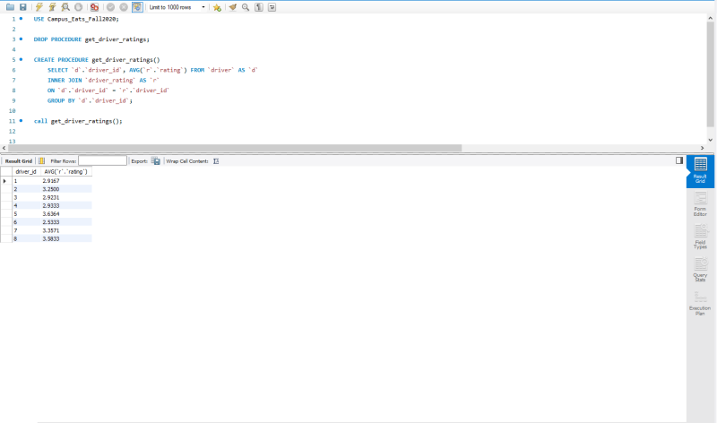
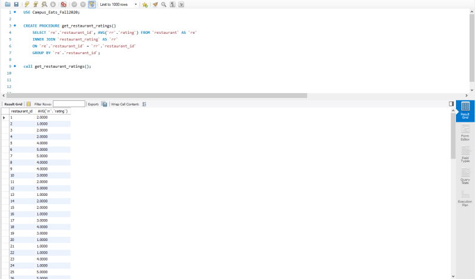
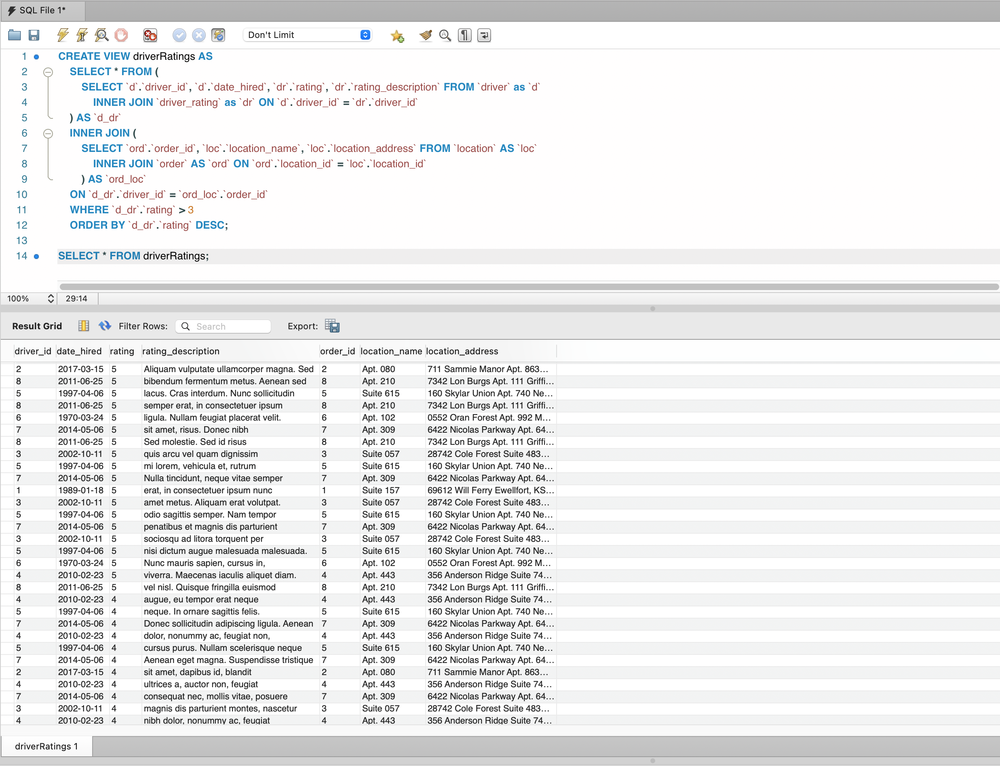
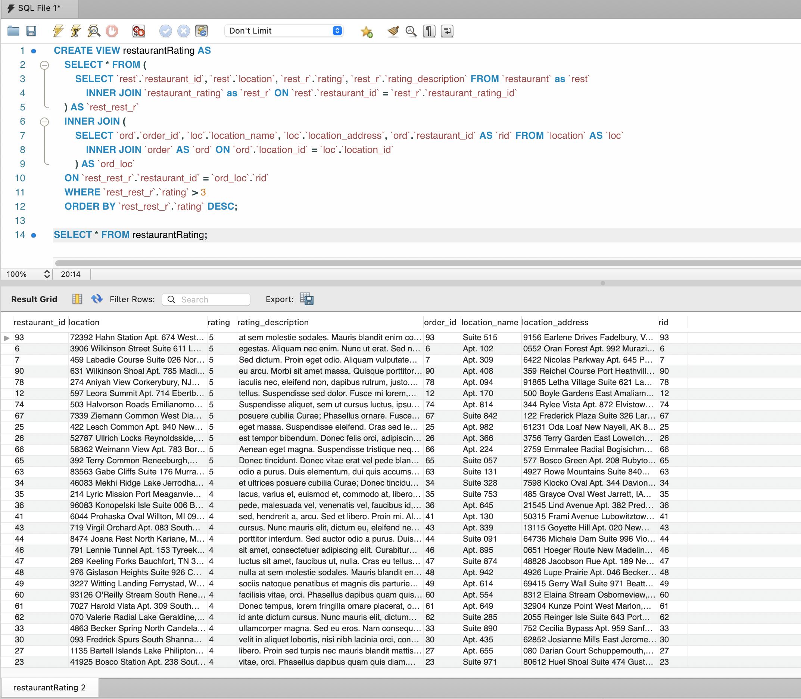

# Campus Eats 
For this project, we have been tasked with implementing a rating system into an already existing food ordering system. The rating system will be for providing users with relevant information that may or may not affect their decision when choosing a restaurant or driver. The basic functionality will include viewing ratings, creating ratings, and administrative tools that will allow administrators to view analytical data about all of the restaurants and drivers in the system. On top of the implementation of the rating system, the provided database will also be modified to suit our needs.

## Group Members
1. Stephen Collins
2. Isaiah Thomas

## Use Case for Rating System

## Business Rules
1. Customers can place ratings on restaurants and drivers
2. Customers can also search for ratings(restaurant and driver) prior to placing an order
3. Administrator can insert ratings into the system
4. Administrator can delete rating from the system
5. Administrator verify ratings from customers

## EERD (full database)

Narative: The rating system consists of two tables related to `order`, `driver`, and `restaurant`. Each rating table (`restaurant_rating` and `driver_rating`) is related to an order which ties the user, driver, restaurant, and rating together. Each rating consists of 3 fields including `id`, `rating`, and `rating_description`. With this system we can perform JOINS to query for worst/best drivers and restaurants as seen [below](#Current-Rating-Relationship-Queries).

## Data Dictionary

The data dictionary can be found [here](./docs/DB-Dictionary.html).

## Query Optimization
To ensure optimal query run-times, we employed the use of a slow query log. Through the use of a slow query log, we were
able to ensure that all of our queries were running as optimally as possible. As well as a slow query log, we made sure 
to use to minimize the amount of results processed during our queries. For example, we made sure to include "WHERE" clauses in order to allow the SQL server to process the data in smaller datasets. We also made sure to avoid using "OR" when completing inner joins because it would increase the runtime of the overall query.

## Stored Procedure
### Average Driver Rating Procedure

### Average Restaurant Rating Procedure

## Custom Views

### Driver Rating View

### Restaurant Rating View

## Web/App Implementation (Optional) or Description of Future Work
Future work would involve building a flask application and using SQLAlchemy to query the database. All
future database modifications would be done through Alembic.
## MySQL dump

The MySQL dump file can be found [here](./Campus_Eats_SQL_D3_Dump.sql).

## Rating Relationship Queries

Inner join between `driver` and `driver_rating` tables.

Inner join between `restaurant` and `restaurant_rating` tables.

## Youtube Video

