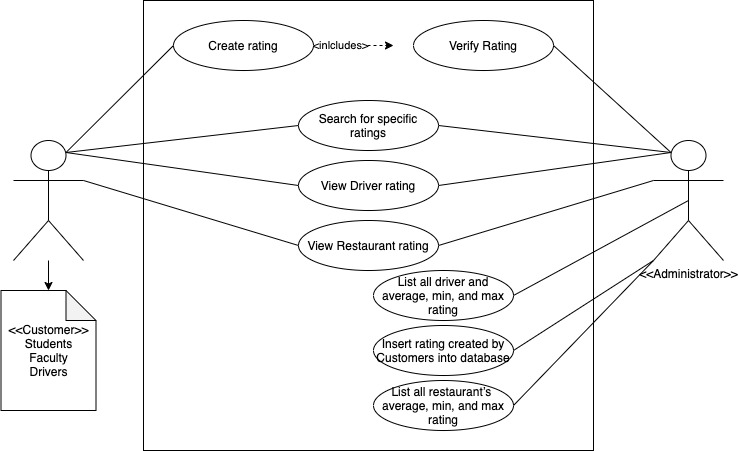
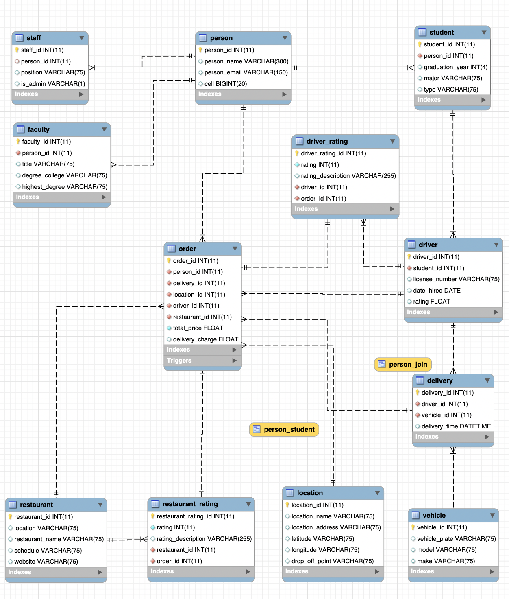
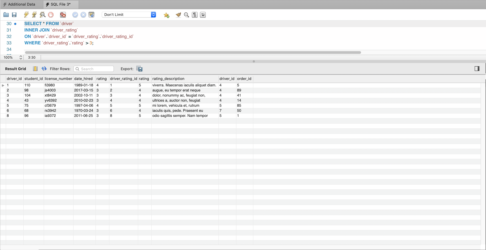
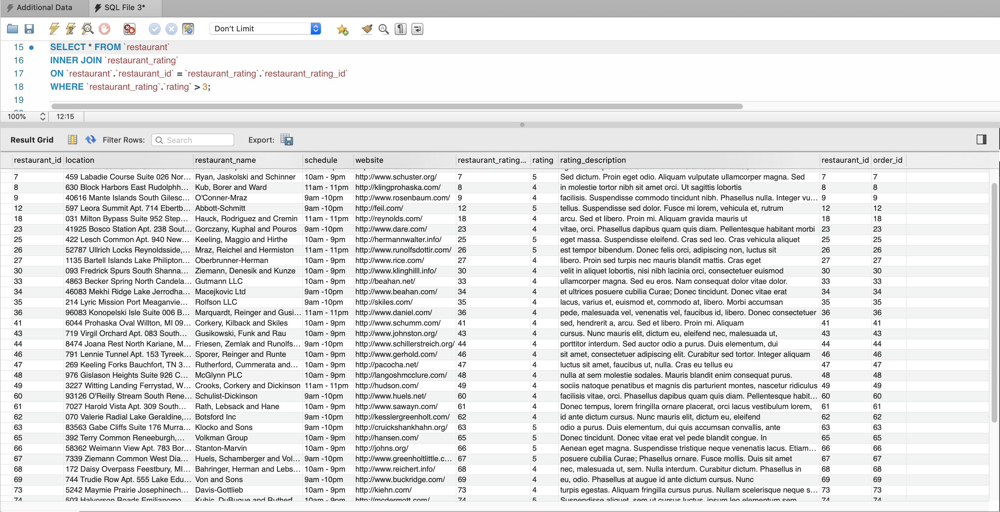

# Campus Eats 
For this project, we have been tasked with implementing a rating system into an already existing food ordering system. The rating system will be for providing users with relevant information that may or may not affect their decision when choosing a restaurant or driver. The basic functionality will include viewing ratings, creating ratings, and administrative tools that will allow administrators to view analytical data about all of the restaurants and drivers in the system. On top of the implementation of the rating system, the provided database will also be modified to suit our needs.

## Group Members
1. Stephen Collins
2. Isaiah Thomas

## Use Case for Rating System

## Business Rules
1. Customers can place ratings on restaurants and drivers
2. Customers can also search for ratings(restaurant and driver) prior to placing an order
3. Administrator can insert ratings into the system
4. Administrator can delete rating from the system
5. Administrator verify ratings from customers

## EERD (full database)

Narative: The rating system consists of two tables related to `order`, `driver`, and `restaurant`. Each rating table (`restaurant_rating` and `driver_rating`) is related to an order which ties the user, driver, restaurant, and rating together. Each rating consists of 3 fields including `id`, `rating`, and `rating_description`. With this system we can perform JOINS to query for worst/best drivers and restaurants as seen [below](#Current-Rating-Relationship-Queries).

## Data Dictionary

The data dictionary can be found [here](./docs/DB-Dictionary.html).

## MySQL Queries

## Stored Procedure

## Web/App Implementation (Optional) or Description of Future Work

## MySQL dump

The MySQL dump file can be found [here](./Campus_Eats_SQL_D3_Dump.sql).

## Current Rating Relationship Queries

Inner join between `driver` and `driver_rating` tables.

Inner join between `restaurant` and `restaurant_rating` tables.

## PPT Video (link)
